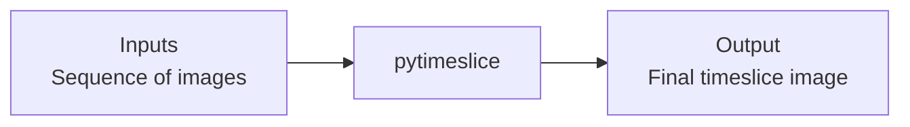
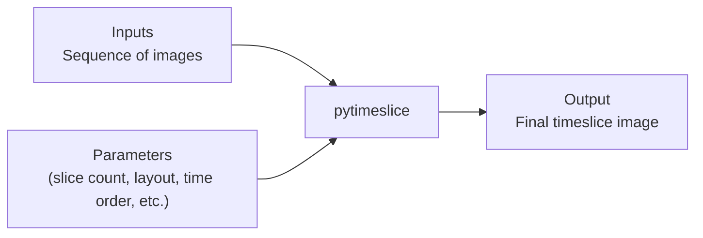

## what even is a timeslice?

a timeslice in the world of photography refers to an image that is divided into multiple slices, each representing the space at a different time. usually, this is done by dividing the image into some number of vertical slices where each slice represents the space at a different time. 

for example, below is a timeslice i created to show a day to night transition of the 401 highway from Don Mills Rd.

![[401-bayview-timeslice-401.jpeg]]

traditionally, to create a timeslice composition, you use an image editing software such as photoshop, manually define the slice layout, then place each image into its assigned slice. however, this is a tedious and time consuming process. to make matters worse, if you decide to go with a different layout, you need to restart the process. 

## timeslice from an engineering mindset

looking at the time slice from an engineering mindset, we can automate this process and go even further by defining custom masks and customizable parameters. 

at the most basic level, we know that a grayscale image is a 2d array where each value represents the 'brightness' of the pixel, i.e. `0` is black and `255` is white. 

add one more dimension, effectively making it a 3d array, and the image can store colour because each pixel now has three separate values: red, green and blue. 

i go into more detail on the technical depth of the data structure on my [medium post](https://medium.com/@nopsykhi/thinking-about-the-timeslice-photograph-as-a-data-structure-c491ac32764e), give it a read if this interests you.

anyhow, now that we know how to think of an image as data, we can see that creating a timeslice like the one above means dividing the image array column by column, each division is a slice that represents a specific moment in time. 

we can take this a step further by adding customizable parameters, letting you control different aspects of the final image:

## what about different layouts?

the divison of the image into multiple columns is one layout, i wanted `pytimeslice` to give you finer control over the layout of the timeslice. i chose to do this with "masks." 

you may ask: what is a mask and how does it work?

- a mask is simply a 2d array scaled to the same dimensions as the input image sequence. each value in the mask describes where that pixel sits in the layout. 
- `pytimeslice` uses those values to group pixels into the requested number of slices, building a `slice_map`, which becomes the actual layout. 
- during rendering, each slice in the slice_map is matched with a frame from the image sequence and the corresponding pixels are copied into the output 

## wat

ok that might have been too much yap, but basically, `pytimeslice` can also do this:

![[Toronto-Radial-sunset-still.jpeg]]

or this:

![[still-13a6fff8576a45f2a1be14bf79fb61e2.png]]

you also have the ability to define your own masks, so the possibilities are endless (and repeatable). 

## check it out on [github](https://github.com/nxaden/pytimeslice)

`pytimeslice` is open source and actively maintained by me. if you are interested in composing timeslices, feel free to check it out. and if you end up making something cool with it, send me a dm because i would genuinely love to see it.

